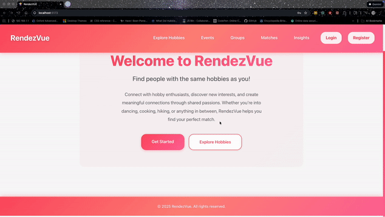
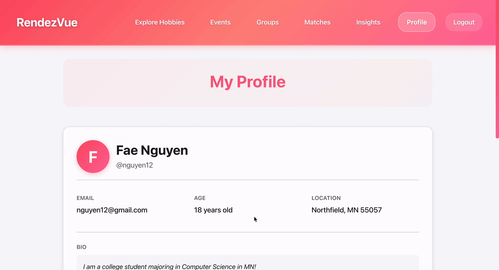
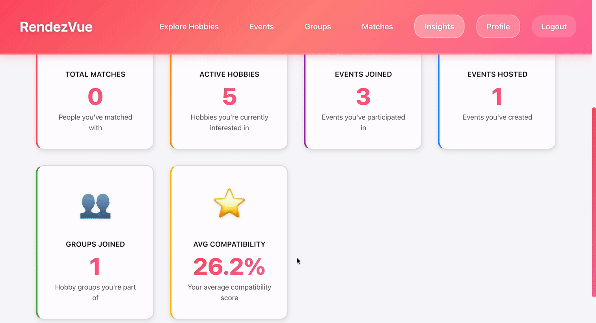
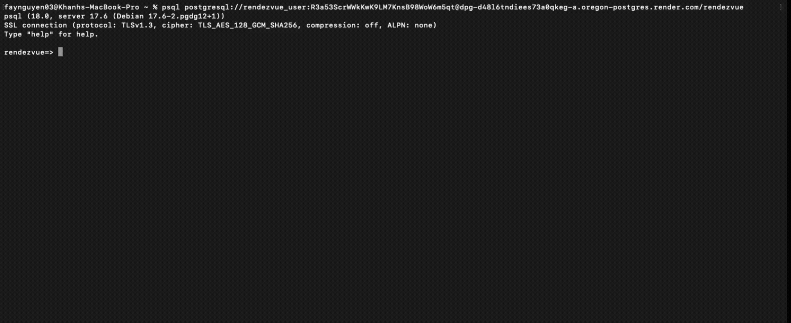

# Milestone 5

This document should be completed and submitted during **Unit 9** of this course. You **must** check off all completed tasks in this document in order to receive credit for your work.

## Checklist

This unit, be sure to complete all tasks listed below. To complete a task, place an `x` between the brackets.

- [X] Deploy your project on Render
  - [X] In `readme.md`, add the link to your deployed project
- [X] Update the status of issues in your project board as you complete them
- [X] In `readme.md`, check off the features you have completed in this unit by adding a ✅ emoji in front of their title
  - [X] Under each feature you have completed, **include a GIF** showing feature functionality
- [X] In this document, complete the **Reflection** section below
- [X] 🚩🚩🚩**Complete the Final Project Feature Checklist section below**, detailing each feature you completed in the project (ONLY include features you implemented, not features you planned)
- [X] 🚩🚩🚩**Record a GIF showing a complete run-through of your app** that displays all the components included in the **Final Project Feature Checklist** below
  - [X] Include this GIF in the **Final Demo GIF** section below

## Final Project Feature Checklist

Complete the checklist below detailing each baseline, custom, and stretch feature you completed in your project. This checklist will help graders look for each feature in the GIF you submit.

### Baseline Features (MUST complete ALL)

- [X] The web app includes an Express backend app and a React frontend app.
- [X] The web app includes dynamic routes for both frontend and backend apps.
- [X] The web app is deployed on Render with all pages and features working.

#### Backend Features

- [X] The web app implements at least one of each of the following database relationship in Postgres:
    * [X] one-to-many
    * [X] many-to-many with a join table
- [X] The web app implements a well-designed RESTful API that:
    * [X] supports all four main request types for a single entity (ex. tasks in a to-do list app): GET, POST,PATCH, and DELETE
    * [X] the user can view items, such as tasks
    * [X] the user can create a new item, such as a task
    * [X] the user can update an existing item by changing some or all of its values, such as changing the title of task
    * [X] the user can delete an existing item, such as a task
- [X] Implements proper naming conventions for routes.
- [X] The web app includes the ability to reset the database to its default state.

#### Frontend Features

- [X] The web app implements at least one redirection, where users are able to navigate to a new page with a new URL within the app (Register -> Log In)
- [X] The web app implements at least one interaction that the user can initiate and complete on the same page without navigating to a new page (create new hobby)
- [X] The web app uses dynamic frontend routes created with React Router.
- [X] The web app uses hierarchically designed React components:
    * [X] Components are broken down into categories, including page and component types.
    * [X] Corresponding container components and presenter components as appropriate.
- [X] The project is deployed on Render with all pages and features that are visible to the user are working as intended

### Custom Features (MUST complete TWO)

- [X] The web app gracefully handles errors.
- [X] The user can filter or sort items based on particular criteria as appropriate for your use case.
- [X] Data is automatically generated in response to a certain event or user action. Examples include generating a default inventory for a new user starting a game or creating a starter set of tasks for a user creating a new task app account.(match and insight entry created when a new user register)
- [X] Data submitted via a POST or PATCH request is validated before the database is updated (e.g. validating that an event is in the future before allowing a new event to be created)

### Stretch Features

- [X] A subset of pages require the user to log in before accessing the content.
- [X] Restrict available user options dynamically, such as restricting available purchases based on a user's currency. (admin can kick or add other user admin)

## Final Demo GIF

### ✅ Hobby-Based and location-based Matching

Connect people nearby who share the same favorite hobbies, from ballroom dancing, cooking, hiking to raving, by selecting interests in the user's profile. The app uses location data to suggest people within a chosen distance radius, so you can easily meet up locally.

### ✅ Event Discovery

Create or join hobby-related events in the nearby area, whether it’s a weekend dance class, art jam, cooking class, or running group. If you create an event

### ✅ Authentication

Users need to create an account or log in to access the app’s features. They can sign up using their email, phone number, or third-party accounts (such as Google or Facebook). Authentication ensures user privacy and security while allowing the app to personalize hobby matches and save preferences. Once logged in, users can manage their profiles, update interests, and start connecting with nearby hobby partners.(gif goes here)

### ✅  Hobby Explore Page

Discover trending hobbies and create hobbies for ourselves.

### ✅ Group Matching

Not just one-on-one — join small groups of people who share your hobby for more social and inclusive meetups.

### ✅ Personalized Profiles

Show off the user's hobbies and information their personalized profile. They can also upload photos or achievements related to their interests. (further development)

### ✅ User Insights 

Get data-driven insights into how well the user match with others based on shared interests, frequency of interaction, and proximity.

### ✅ Database Implementation

Database and server side implemented completely

## Reflection

### 1. What went well during this unit?

A lot of progress was made on the project. We were able to create the backend, frontend, and set up our database. In addition to that, it was nice to start to see some of our wireframes start to take life in the webapp.

### 2. What were some challenges your group faced in this unit?

Our group faced some coordination issues due to our busy schedules, so it was difficult to find time to work concurrently. We were grateful to be able to commit to the project separately and merge our work as needed.

### 3. Did you finish all of your tasks in your sprint plan for this week? If you did not finish all of the planned tasks, how would you prioritize the remaining tasks on your list?

This week, we were not able to accomplish all tasks in our sprint plan. We need to seed the sample data for our events, hobbies, and other users. In addition to that, adding options to view other users' profiles from the exploring and event pages would be helpful. That way, users could match by looking at each others' profiles.

### 4. Which features and user stories would you consider “at risk”? How will you change your plan if those items remain “at risk”?

Currently, our biggest 'at risk' feature would be our location-based discovery. With the short timeframe we have, it does not seem feasible that we could accomplish this. The running idea was to utilize GPS data in order to match users by location, but it may be more prudent to simplify this feature to something like matching by city or zip code—things that have already been implemented.

### 5. What additional support will you need in upcoming units as you continue to work on your final project?

For the most part, we will simply require time in order to finish the rest of our features and flesh out what we currently have.

